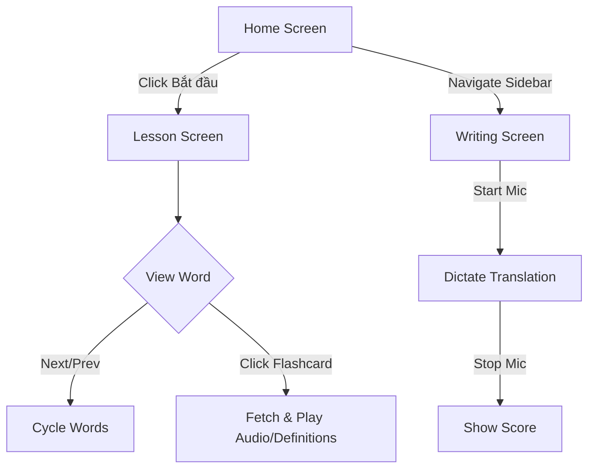

# Functional Specification Document

**Project**: Conversational English Web App (Anti-greeting)
**Type**: web-frontend
**Version**: 1.0
**Last Updated**: 2026-04-09

---

## 1. Feature Specifications

### Lessons

**Description**: Present 3,000 common English words to the user via flashcards, integrating definitions, audio pronunciation, and interactive usage via external dictionary APIs.

| ID | Requirement | Priority | Status |
|----|------------|----------|--------|
| FR-LES-001 | Fetch and display a daily random batch of 10 English words | High | Implemented |
| FR-LES-002 | Fetch meanings and US-accent audio from Free Dictionary API | High | Implemented |
| FR-LES-003 | Navigate flashcards sequentially (prev/next) | High | Implemented |

**Use Case References**: [docs/usecases/lessons/](../../../docs/usecases/lessons/)

### Writing Practice

**Description**: Immersive, real-world application of vocabulary by converting user speech-to-text, and calculating semantic-based scoring to evaluate accuracy.

| ID | Requirement | Priority | Status |
|----|------------|----------|--------|
| FR-WRT-001 | Capture user voice input using Speech Recognition layer | High | Draft/Implemented |
| FR-WRT-002 | Convert recognized speech into text representation | High | Draft/Implemented |
| FR-WRT-003 | Assign semantic-based score to translation/sentence | Medium | Draft |

**Use Case References**: [docs/usecases/writing/](../../../docs/usecases/writing/)

### Video Context

**Description**: View video clips showing native English speakers using specific words in a contextual manner using YouGlish.

| ID | Requirement | Priority | Status |
|----|------------|----------|--------|
| FR-VID-001 | Display embedded YouGlish video for specific vocabulary words | Medium | Draft/Implemented |

**Use Case References**: [docs/usecases/video/](../../../docs/usecases/video/)

---

## 2. Screen Descriptions

### Home Screen
- **Purpose**: Landing page explaining the value proposition.
- **Layout**: Centered hero banner, call-to-action to start learning, and feature highlight cards (Phương pháp, Trọng tâm, Phản xạ).
- **Interactive Elements**: Start learning button `/lesson`.
- **States**: Static page.

### Lesson Screen
- **Purpose**: Facilitate spaced-repetition and learning sequence using Flashcards.
- **Layout**: Progress indicator, central Flashcard component, Next/Prev navigation buttons at bottom.
- **Interactive Elements**: Flashcard dictionary lookups, audio playback button, Next/Prev pagination.
- **States**: Loading words, displaying specific word (1 to 10), completed state.

### Writing Screen
- **Purpose**: Practice speaking/writing via voice recognition.
- **Layout**: Main prompt area, dictation area, feedback/scoring metric.
- **Interactive Elements**: Microphone start/stop toggle, submit button.
- **States**: Idle, Listening for audio, processing/scoring, displaying result.

## 3. Screen Flows

## 5. Data Models

### Word Entity

| Field | Type | Constraints | Description |
|-------|------|-------------|-------------|
| wordString | String | Not Null | English word from Oxford 3k |
| phonetic | String | Optional | IPA phonetic spelling |
| audio | String | Optional | URL to US-accent MP3 |
| meanings | Array | Optional | Part of speech and definitions |

## 6. Business Rules & Validations

| ID | Rule | Applies To | Enforcement |
|----|------|-----------|-------------|
| BR-001 | Daily words batch must contain exactly 10 words selected randomly | Lessons | Client |
| BR-002 | Next button should act as "Finish" if on the last word | Lessons | Client |
| BR-003 | Only allow speech recognition on browsers that support webkitSpeechRecognition/SpeechRecognition | Writing Practice | Client |

## 7. Non-Functional Requirements

| Category | Requirement | Target |
|----------|------------|--------|
| Performance | Time to display first translation | < 2s |
| Accessibility | Support keyboard shortcuts for navigation (Space for audio, arrows to flip) | WCAG Level A |
| API Reliance | Gracefully handle Free Dictionary API rate limiting / errors | Show fallback messages |
