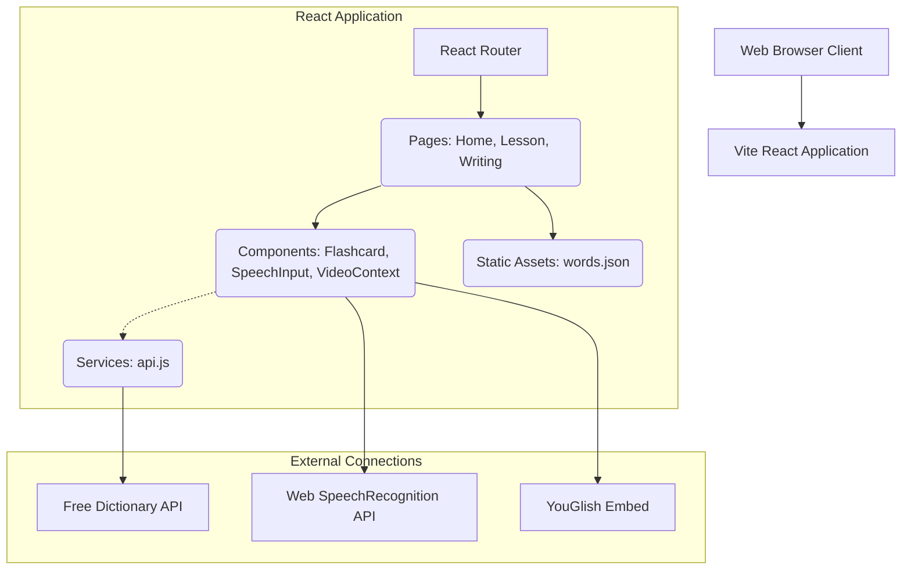

# System Architecture

## 1. System Overview

Anti-greeting is a fully client-side React Web Application (Single Page Application). It stores core lesson vocabulary natively in the bundled assets and fetches dynamic assets (Definitions, Audio) immediately at runtime via public APIs. No proprietary database or backend is deployed.

## 2. Application Architecture Diagram

## 3. Component Breakdown

*   **Routing Layer**: React Router dictates module switching: Landing `/`, Flashcard Module `/lesson`, Dictation Practice `/writing`.
*   **Static Data Pool**: `src/data/words.json` contains a flat array of string literals (Oxford 3k words). The `Lesson.jsx` page picks a random subset on instantiation.
*   **External Integration Layer (`api.js`)**: Encapsulates `fetch()` logic for the dictionary payload, exposing standardized `getWordDetails(word)` methods that strip the highly nested Free Dictionary JSON down to parts-of-speech, definition strings, and audio URLs.
*   **Native Hardware Integration**: `SpeechInput.jsx` bridges the `SpeechRecognition` constructor, controlling microphone hardware toggle states and piping string transcripts up to the `Writing.jsx` parent for scoring calculations.

## 4. Future Architecture Considerations

Currently, progress state (like "Day 1 Complete" or "Score History") is not preserved. Integrating `localStorage` state hooks or adding a lightweight Backend-as-a-Service (like Firebase/Supabase) is the logical next step for User Authentication and progress tracking.
