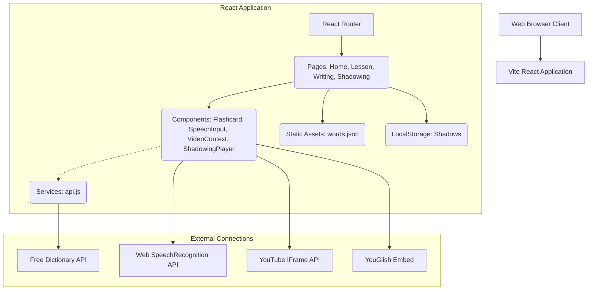

# System Architecture

## 1. System Overview

Anti-greeting is a fully client-side React Web Application (Single Page Application). It stores core lesson vocabulary natively in the bundled assets and fetches dynamic assets (Definitions, Audio) immediately at runtime via public APIs. No proprietary database or backend is deployed.

## 2. Application Architecture Diagram

## 3. Component Breakdown

*   **Routing Layer**: React Router dictates module switching: Landing `/`, Flashcard Module `/lesson`, Dictation Practice `/writing`, Shadowing Studio `/shadowing`.
*   **Static Data Pool**: `src/data/words.json` contains a flat array of string literals (Oxford 3k words). The `Lesson.jsx` page picks a random subset on instantiation.
*   **External Integration Layer (`api.js`)**: Encapsulates `fetch()` logic for the dictionary payload.
*   **Shadowing & Playback Layer**: `ShadowingPlayer.jsx` implements the YouTube IFrame Player API using a custom `forwardRef` pattern to allow imperative video control (seeking, state polling).
*   **Native Hardware Integration**: `SpeechInput.jsx` bridges the `SpeechRecognition` constructor, and `Shadowing.jsx` utilizes the `MediaRecorder` API for voice capture.

## 4. State Management & Persistence

The application currently uses a decentralized state model:
*   **Ephemeral State**: Lessons and Writing sessions are session-based (lost on refresh).
*   **Persistent State**: Shadowing segments, recording counts, and transcriptions are saved to `localStorage` keyed by YouTube `videoId`. This ensures users can return to a specific video and continue their practice.

Currently, progress state (like "Day 1 Complete" or "Score History") is not preserved. Integrating `localStorage` state hooks or adding a lightweight Backend-as-a-Service (like Firebase/Supabase) is the logical next step for User Authentication and progress tracking.
